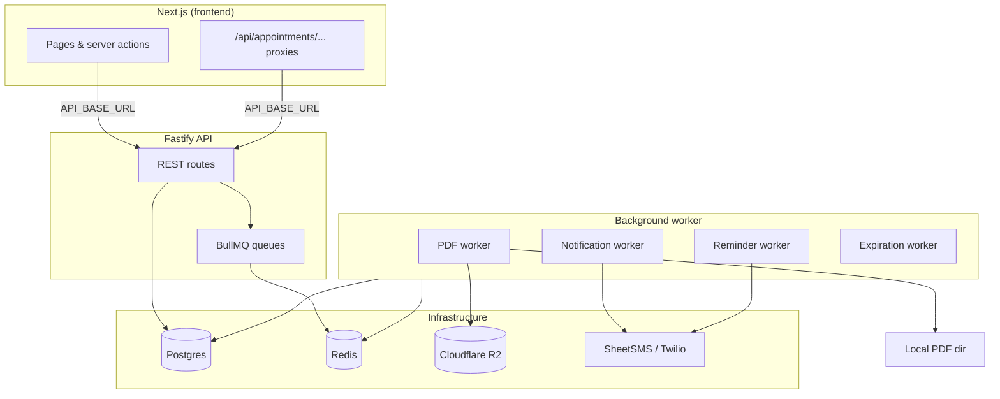

# Interpreter Scheduling Platform

A coordinator–interpreter scheduling system for medical interpretation work. Coordinators create appointments and assign interpreters; interpreters receive SMS notifications, view open work, and check in/out of sessions.

The codebase is split into two apps:

| App | Path | Role |
|---|---|---|
| **API** | `api/` | Fastify REST API, background workers, Postgres, Redis |
| **Web** | `../interpreter-app-frontend/` | Next.js UI and API route proxies |

---

## Architecture



**Request flow (happy path):**

1. Coordinator creates an appointment in the web UI → server action POSTs to the API.
2. API saves the appointment and enqueues PDF generation.
3. PDF worker builds the PDF, saves locally (optional), uploads to R2, and records platform events.
4. Interpreter requests an assignment (API) → coordinator approves (API) → notification worker sends confirm SMS.
5. Reminder worker runs on a BullMQ repeat schedule and sends a 1-hour-before SMS with a check-in link.
6. SMS links point at `WEB_APP_URL` (the Next.js app), which proxies PDF/event requests back to the API.

---

## Backend (`api/`)

### Tech stack

| Layer | Technology |
|---|---|
| Runtime | Node.js 22, TypeScript (ESM) |
| HTTP server | Fastify 5 |
| Database | PostgreSQL via Prisma |
| Job queue | BullMQ + Redis |
| PDF generation | pdf-lib |
| Object storage | Cloudflare R2 (S3-compatible) |
| SMS | SheetSMS (Google Sheets) or Twilio |
| Email | Resend (optional) |
| Validation | Zod |

### Processes

Two Node processes must run in development (and in production):

| Process | Command | Purpose |
|---|---|---|
| **API server** | `npm run dev` / `npm start` | Serves HTTP on port 4000 |
| **Worker** | `npm run dev:worker` / `npm run start:worker` | Consumes BullMQ jobs |

Local Postgres and Redis are provided via Docker Compose (`npm run docker:up`).

### Major components

#### `src/server.ts` — HTTP entrypoint

Registers Fastify plugins (CORS, sensible errors) and mounts all route modules under `/api`.

#### Route modules

| Module | Prefix | What it does |
|---|---|---|
| `health/health.routes.ts` | `/api/health` | Liveness check |
| `appointments/appointment.routes.ts` | `/api/appointments` | Create appointments, list open work, fetch platform events, download PDFs |
| `assignments/assignment.routes.ts` | `/api/assignments` | Request assignment, approve request, record check-in/out events |
| `interpreters/interpreter.routes.ts` | `/api/interpreters` | Create and list interpreters |
| `reminders/reminder.routes.ts` | `/api/jobs/...` | Manual job triggers (Bearer `JOB_SECRET`) for expiration and reminders |

#### `src/appointments/` — Appointment lifecycle

- **`appointment.service.ts`** — Creates appointments, sets coverage expiry based on urgency, queues PDF generation, records a `PDF_GENERATION_QUEUED` platform event.
- **`appointment.repository.ts`** — Prisma queries for create, open listings, PDF status updates, expiration.
- **`appointment.schema.ts`** — Zod validation for create payload (including `savePdfLocally` flag).

Coverage windows (from `utils/constants.ts`):

- **STANDARD** — 24 hours
- **SAME_DAY** — 60 minutes
- **URGENT** — 30 minutes

#### `src/assignments/` — Assignment lifecycle

- **`assignment.service.ts`** — Orchestrates request → approve → event recording; each step enqueues a notification job.
- **`assignment.repository.ts`** — Creates requests, promotes requests to confirmed assignments, tracks `reminderOneHourSentAt`, finds assignments due for reminders.

#### `src/workers/` — Background jobs

All workers share a Redis connection and are started from `workers/index.ts`. On startup, reminder repeat schedules are registered.

| Worker | Queue | Job names | What it does |
|---|---|---|---|
| `pdf.worker.ts` | `pdf` | `generate_appointment_pdf` | Builds appointment PDF, optionally saves to `LOCAL_PDF_DIR`, uploads to R2, updates status and platform events |
| `notification.worker.ts` | `notifications` | `assignment_confirmed`, `assignment_event`, `coordinator_assignment_request` | Sends confirm SMS (and email if configured); other job types are stubbed/logged |
| `reminder.worker.ts` | `reminders` | `send_one_hour_reminders` | Finds confirmed assignments starting in ~1 hour, sends reminder SMS, marks reminder sent |
| `expiration.worker.ts` | `expirations` | `expire_open_appointments` | Expires open appointments past `coverageExpiresAt`, deletes R2 PDFs |

#### `src/reminders/` — Reminder scheduling

- **`register-reminder-schedules.ts`** — Registers a BullMQ repeating job on worker startup (interval: `REMINDER_REPEAT_EVERY_MINUTES`, default 5 min).
- **`reminder-window.ts`** — Computes the time window for 1-hour reminders (`REMINDER_ONE_HOUR_MINUTES` ± `REMINDER_ONE_HOUR_WINDOW_MINUTES`).

#### `src/notifications/` — Outbound messaging

- **`notification.service.ts`** — `sendSms()` and `sendEmail()` with `NotificationLog` + `PlatformEvent` audit trail.
- **`assignment-confirmed.message.ts`** — Builds the multi-line confirm SMS (patient, address, PDF link, assignment link, calendar placeholder).
- **`providers/`** — SMS provider abstraction:
  - **`SheetSmsProvider.ts`** — Writes to a Google Sheet via service account; polls for send confirmation.
  - **`TwilioProvider.ts`** — Standard Twilio SMS (optional; switch with `SMS_PROVIDER=twilio`).

Default SMS provider is **SheetSMS** (`SMS_PROVIDER=sheetsms`).

#### `src/storage/` — PDF persistence

- **`local-pdf.service.ts`** — Saves/reads PDFs on disk (`LOCAL_PDF_DIR`). Used when coordinators opt in at create time; also serves as fallback download source.
- **`r2.service.ts`** — Upload/download/delete against Cloudflare R2.

PDF download route prefers local file, then falls back to R2.

#### `src/pdf/` — PDF generation

- **`pdf.service.ts`** — Uses pdf-lib to render appointment details into a downloadable PDF.

#### `src/platform-events/` — Audit log

- **`platform-event.repository.ts`** — Append-only event stream per appointment/assignment (PDF stages, SMS sent/failed, expiration, etc.). The frontend polls these during PDF generation.

#### `src/config/env.ts` — Environment validation

All configuration is validated with Zod at startup. Key variables:

| Variable | Purpose |
|---|---|
| `DATABASE_URL` | Postgres connection |
| `REDIS_URL` | Redis for BullMQ |
| `JOB_SECRET` | Auth for manual job endpoints |
| `WEB_APP_URL` | Base URL for links in SMS (must point at the deployed Next.js app) |
| `SMS_PROVIDER` | `sheetsms` or `twilio` |
| `GOOGLE_*` | SheetSMS credentials and sheet ID |
| `R2_*` | Cloudflare R2 bucket config |
| `REMINDER_*` | Reminder timing tuning |

### Data model (Prisma)

Core entities in `prisma/schema.prisma`:

| Model | Purpose |
|---|---|
| `User` / `Interpreter` | User accounts and interpreter profiles (auth not wired yet) |
| `Appointment` | Scheduled session with facility, patient, pay, urgency, PDF status |
| `AssignmentRequest` | Interpreter expressing interest in an open appointment |
| `Assignment` | Confirmed interpreter–appointment pairing with check-in/out timestamps |
| `AssignmentEvent` | Event log (check-in, check-out, no-show, etc.) |
| `NotificationLog` | SMS/email send attempts and outcomes |
| `PlatformEvent` | System-level audit events for UI polling and debugging |

### API endpoints (current)

| Method | Path | Notes |
|---|---|---|
| GET | `/api/health` | Health check |
| POST | `/api/appointments` | Create appointment |
| GET | `/api/appointments/open` | List open appointments |
| GET | `/api/appointments/:id/events` | Platform events for PDF status polling |
| GET | `/api/appointments/:id/pdf` | Download PDF (local or R2) |
| POST | `/api/assignments/requests` | Interpreter requests assignment |
| POST | `/api/assignments/approve` | Coordinator confirms assignment → confirm SMS |
| POST | `/api/assignments/:id/events` | Record check-in/out/etc. |
| POST | `/api/interpreters` | Create interpreter |
| GET | `/api/interpreters` | List interpreters |
| POST | `/api/jobs/send-one-hour-reminders` | Manual reminder trigger |
| POST | `/api/jobs/expire-open-appointments` | Manual expiration trigger |

**Not yet implemented:** `GET /api/assignments/:id`, `GET /api/appointments/:id`, pending-requests listing, calendar `.ics` endpoint.

---

## Frontend (`interpreter-app-frontend/`)

### Tech stack

| Layer | Technology |
|---|---|
| Framework | Next.js 15 (App Router) |
| UI | React 19, server components + client components |
| Forms | Server Actions |
| Auth | next-auth scaffolded (not wired) |
| API client | `fetch` via `src/lib/api.ts` |

### Environment

| Variable | Purpose |
|---|---|
| `API_BASE_URL` | Fastify API base URL (default `http://localhost:4000`) |

All server-side fetches (pages, actions, route handlers) use this to reach the backend.

### Major components

#### `src/lib/api.ts` — Backend client

Shared `apiFetch()` helper for JSON requests to the Fastify API. Used by server components and server actions.

#### Pages

| Route | File | What it does |
|---|---|---|
| `/` | `app/page.tsx` | Landing with links to coordinator and interpreter flows |
| `/coordinator/appointments/new` | `app/coordinator/appointments/new/page.tsx` | Create-appointment form (patient, facility, pay, urgency, etc.) |
| `/coordinator/appointments/[id]/created` | `app/coordinator/appointments/[id]/created/page.tsx` | Post-create success page with PDF status polling |
| `/interpreter/available` | `app/interpreter/available/page.tsx` | Read-only list of open appointments from the API |
| `/interpreter/assignments/[assignmentId]` | `app/interpreter/assignments/[assignmentId]/page.tsx` | **Stub** — placeholder for check-in/out UI |

#### `app/coordinator/appointments/new/actions.ts` — Create flow

Server action that POSTs appointment data to `/api/appointments`, then redirects to the created page. Supports `savePdfLocally` checkbox.

#### `app/coordinator/appointments/[id]/created/status.tsx` — PDF polling UI

Client component that polls `/api/appointments/:id/events` (via Next proxy) until PDF generation succeeds, partially succeeds (local save only), or fails. Auto-triggers PDF download when ready.

#### API route proxies

These exist so SMS links and browser downloads can use the **frontend origin** (`WEB_APP_URL`) instead of exposing the raw API URL.

| Next route | Proxies to | Purpose |
|---|---|---|
| `/api/appointments/[id]/pdf` | `GET /api/appointments/:id/pdf` | PDF download (used in SMS and coordinator UI) |
| `/api/appointments/[id]/events` | `GET /api/appointments/:id/events` | Platform event polling |

**Not yet implemented:** `/api/appointments/[id]/calendar.ics` proxy (calendar link in confirm SMS is a placeholder).

---

## What's wired vs. stubbed

| Feature | Backend | Frontend |
|---|---|---|
| Create appointment + PDF | ✅ | ✅ |
| PDF status polling + download | ✅ | ✅ |
| List open appointments | ✅ | ✅ (read-only) |
| Request / approve assignment | ✅ (API/curl) | ❌ no UI yet |
| Confirm SMS on approve | ✅ | — |
| 1-hour reminder SMS | ✅ (BullMQ repeat) | — |
| Assignment check-in page | ✅ (API) | ❌ stub only |
| Auth / ownership checks | ❌ deferred | ❌ deferred |
| Coordinator request notification | queued, not sent | — |
| Calendar `.ics` link | placeholder URL | — |
| Timezone-aware SMS dates | ❌ uses server locale | — |

---

## Local development

### Backend

```bash
cd api
# Configure api/.env (see env vars table above)
npm install
npm run docker:up      # Postgres + Redis
npm run prisma:migrate
npm run dev            # API on :4000
npm run dev:worker     # separate terminal
```

### Frontend

```bash
cd ../interpreter-app-frontend
npm install
npm run dev            # Next.js on :3000
```

Set `WEB_APP_URL=http://localhost:3000` in the API `.env` so SMS links match the frontend. Set `API_BASE_URL=http://localhost:4000` for the web app (or rely on the default).

---

## Planned next steps

- Deploy frontend (Vercel) + backend/worker/Postgres/Redis (Railway) so SMS links work on real devices
- Timezone-aware appointment formatting in SMS (`APPOINTMENT_TIMEZONE`)
- Calendar `.ics` endpoint + Next.js proxy
- Read APIs and UI for assignment detail, approve/request flows, and interpreter check-in
